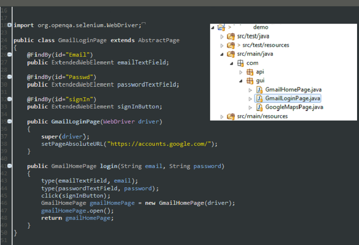
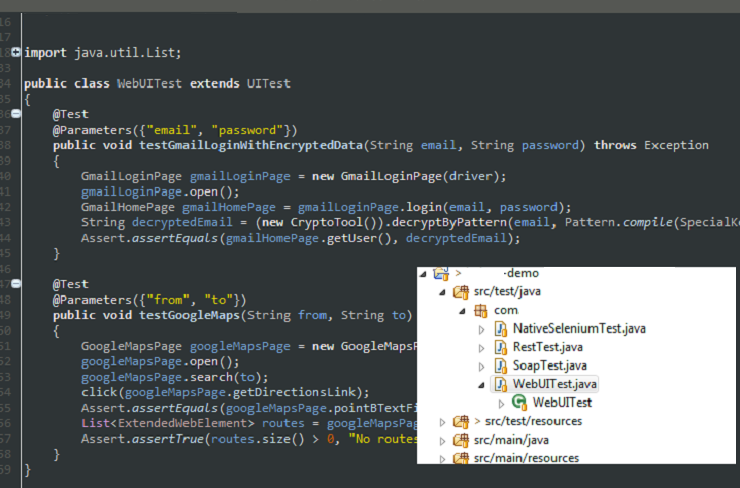
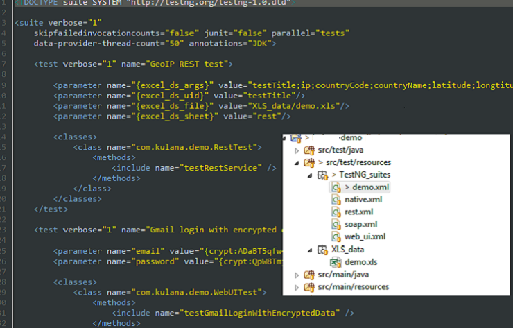

Developing tests with Carina is very straightforward. If you are going to create Web UI tests, you need to go through the following steps:

* **Implement page models with element locators**
In page models, you list all the elements along with Selenium @FindBy annotation, specifying the locator of the HTML element. In constructor, you have to identify the absolute or relative page URL. Also, the page model may contain business logic methods that encapsulate complex user behavior.

* **Implement test case that operates with page objects and performs validations**
Test cases themselves represent composition of page models, so all UI actions are essentially performed via page objects. Test scripts should contain some assertions and UI validation logic.

* **Create TestNG suite configuration that includes tests with appropriate test parameters**
TestNG xml suite descriptors contain test configurations, but also contain test grouping tools that allow creation of different suites: sanity, regression, etc.

